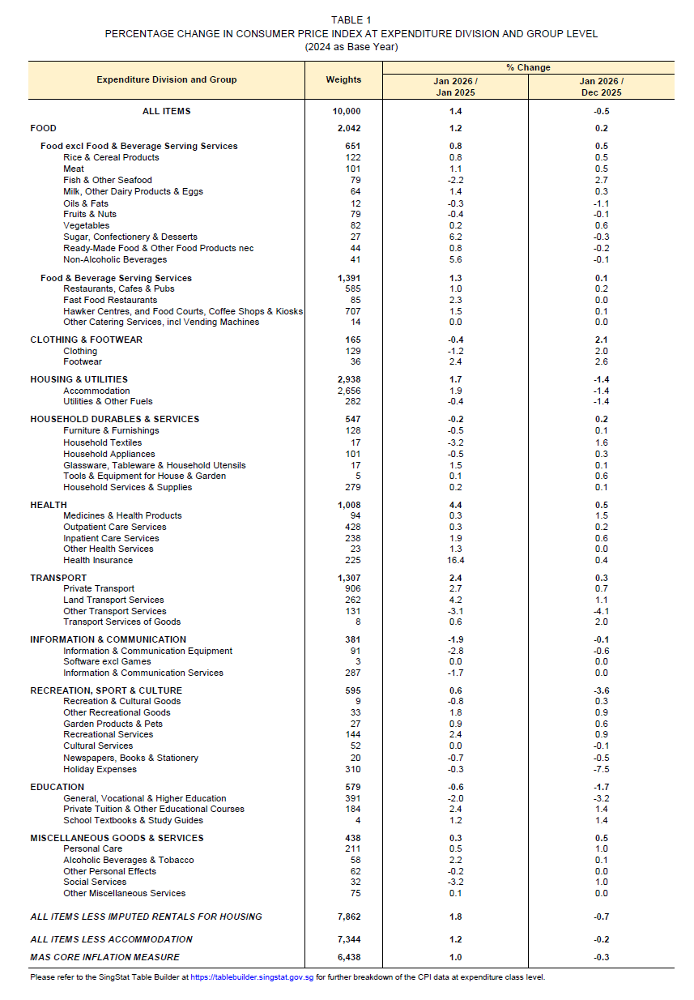
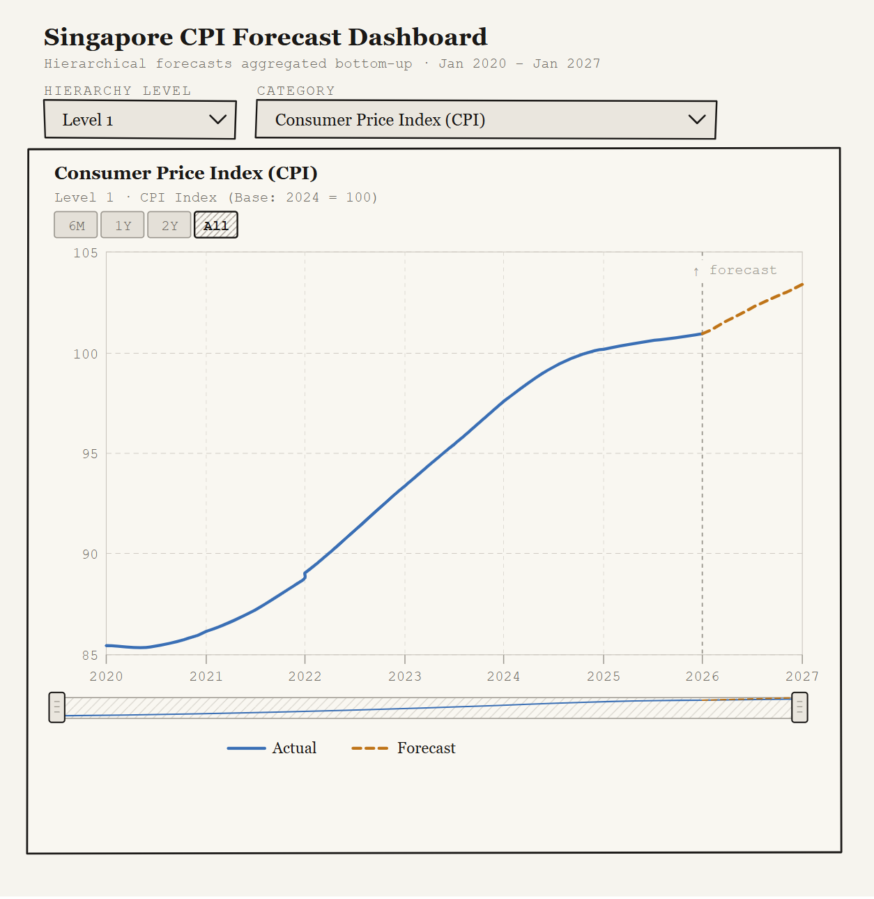

# Take-home Exercise 2 - Project

## Overview

Take-home exercise 2 is a part of preliminary project work of the final group project that we have chosen the topic on, which is to analyse and forecast Singapore Customer Price Index (CPI).

Consumer Price Index (CPI) is a measure of the average change over time in the price paid by households for a fixed basket of goods and services, representing typical consumption patterns in a specific country.

Singapore CPI is compiled on a monthly basis and the categories covered are:

-   Food, Clothing and Footwear

-   Housing & Utilities

-   Household Durables & Services

-   Health

-   Transport

-   Information & Communication

-   Recreation

-   Sport & Culture

-   Education

-   Miscellaneous Goods & Services.

Analysis and outlook on CPI will be useful for multiple stakeholders such as households, businesses, and policymakers to be able to plan ahead.


## Project Objective
The data source that we will be using for this project comes from the **CEIC database**, spanning from January 2020 to January 2026 (Base Year: 2024 = 100). The objective of my assignment is to build a **Prototype on Forecasting** part. The dataset and manipulations performed here is for the purpose of my exploration, in which will be further aligned with the rest of team members before combining everything into our final webpage.

## Data Preparation

### Import Packages
```{r}
pacman::p_load(readxl, tidyverse, timetk, modeltime, tidymodels, lubridate, plotly)
```

### Import Data
The dataset used for this project is Singapore CPI from January 2020 to January 2026.
```{r}
cpi_data_raw <- read_excel("data/SG_CPI_012020_012026_Use.xlsx")
```

### Overview of the Dataset

#### Data Structure
```{r}
str(cpi_data_raw)
```
The above dataset contains 73 rows (73 months of data) and 65 columns (CPI categories).

#### Missingness Check
```{r}
sum(is.na(cpi_data_raw))
```
The above dataset does not contain null value.


## Data Wrangling

### Define Hierarchical Level and Assign Parent to Child (Leaf Nodes)
As the CPI data has levels to it and the structure of the column names does not allow us to automatically separate and identify the levels by delimiter, hence we decided to define the hiearchy manually.

```{r}
hier_map <- tribble(
  ~Category,                                                                    ~Level, ~Parent,

  # Level 1 - Root
  "Consumer Price Index (CPI)",                                                  1,      NA,

  # Level 2 - Major Categories
  "CPI: Food",                                                                   2,      "Consumer Price Index (CPI)",
  "CPI: Clothing and Footwear (C&F)",                                           2,      "Consumer Price Index (CPI)",
  "CPI: Housing & Utilities",                                                   2,      "Consumer Price Index (CPI)",
  "CPI: Household Durables & Services (HDS)",                                   2,      "Consumer Price Index (CPI)",
  "CPI: Health",                                                                2,      "Consumer Price Index (CPI)",
  "CPI: Transport",                                                             2,      "Consumer Price Index (CPI)",
  "CPI: Information & Communication (InfoComm)",                                2,      "Consumer Price Index (CPI)",
  "CPI: Recreation, Sport & Culture (RSC)",                                     2,      "Consumer Price Index (CPI)",
  "CPI: Education",                                                             2,      "Consumer Price Index (CPI)",
  "CPI: Miscellaneous Goods & Services (MG&S)",                                 2,      "Consumer Price Index (CPI)",

  # Level 3 - Food sub-categories
  "CPI: Food Excl Food & Beverage Serving Services (FFBSS)",                    3,      "CPI: Food",
  "CPI: Food & Beverage Serving Services (FBSS)",                               3,      "CPI: Food",

  # Level 3 - C&F children
  "CPI: C&F: Clothing",                                                         3,      "CPI: Clothing and Footwear (C&F)",
  "CPI: C&F: Footwear",                                                         3,      "CPI: Clothing and Footwear (C&F)",

  # Level 3 - Housing & Utilities children
  "CPI: Housing & Utilities: Accommodation",                                    3,      "CPI: Housing & Utilities",
  "CPI: Housing & Utilities: Utilities & Other Fuels",                          3,      "CPI: Housing & Utilities",

  # Level 3 - HDS children
  "CPI: HDS: Furniture & Furnishings",                                          3,      "CPI: Household Durables & Services (HDS)",
  "CPI: HDS: Household Textiles",                                               3,      "CPI: Household Durables & Services (HDS)",
  "CPI: HDS: Household Appliances",                                             3,      "CPI: Household Durables & Services (HDS)",
  "CPI: HDS: Glassware, Tableware & Household Utensils",                        3,      "CPI: Household Durables & Services (HDS)",
  "CPI: HDS: Tools & Equipment For House & Garden",                             3,      "CPI: Household Durables & Services (HDS)",
  "CPI: HDS: Household Services & Supplies (HSS)",                              3,      "CPI: Household Durables & Services (HDS)",

  # Level 3 - Health children
  "CPI: Health: Medicines & Health Products",                                   3,      "CPI: Health",
  "CPI: Health: Outpatient Services",                                           3,      "CPI: Health",
  "CPI: Health: Inpatient Services",                                            3,      "CPI: Health",
  "CPI: Health: Other Health Services (OHS)",                                   3,      "CPI: Health",
  "CPI: Health: Health Insurance",                                              3,      "CPI: Health",

  # Level 3 - Transport children
  "CPI: Transport: Private Transport",                                          3,      "CPI: Transport",
  "CPI: Transport: Land Transport Services",                                    3,      "CPI: Transport",
  "CPI: Transport: Other Transport Services",                                   3,      "CPI: Transport",
  "CPI: Transport: Transport Services Of Goods",                                3,      "CPI: Transport",

  # Level 3 - InfoComm children
  "CPI: InfoComm: Information & Communication Equipment",                       3,      "CPI: Information & Communication (InfoComm)",
  "CPI: InfoComm: Software Excl Games",                                         3,      "CPI: Information & Communication (InfoComm)",
  "CPI: InfoComm: InfoComm Services",                                           3,      "CPI: Information & Communication (InfoComm)",

  # Level 3 - RSC children
  "CPI: RSC: Recreational & Cultural Goods",                                    3,      "CPI: Recreation, Sport & Culture (RSC)",
  "CPI: RSC: Other Recreational Goods (ORG)",                                   3,      "CPI: Recreation, Sport & Culture (RSC)",
  "CPI: RSC: Garden Products & Pets",                                           3,      "CPI: Recreation, Sport & Culture (RSC)",
  "CPI: RSC: Recreational Services",                                            3,      "CPI: Recreation, Sport & Culture (RSC)",
  "CPI: RSC: Cultural Services",                                                3,      "CPI: Recreation, Sport & Culture (RSC)",
  "CPI: RSC: Newspapers, Books & Stationery (NBS)",                             3,      "CPI: Recreation, Sport & Culture (RSC)",
  "CPI: RSC: Holiday Expenses",                                                 3,      "CPI: Recreation, Sport & Culture (RSC)",

  # Level 3 - Education children
  "CPI: Education: General, Vocational & Higher Education (GVH Edu)",           3,      "CPI: Education",
  "CPI: Education: Private Tuition & Other Educational Courses",                3,      "CPI: Education",
  "CPI: Education: School Textbooks & Study Guides",                            3,      "CPI: Education",

  # Level 3 - MG&S children
  "CPI: MG&S: Personal Care",                                                   3,      "CPI: Miscellaneous Goods & Services (MG&S)",
  "CPI: MG&S: Alcoholic Drinks & Tobacco",                                      3,      "CPI: Miscellaneous Goods & Services (MG&S)",
  "CPI: MG&S: Personal Effects",                                                3,      "CPI: Miscellaneous Goods & Services (MG&S)",
  "CPI: MG&S: Social Services",                                                 3,      "CPI: Miscellaneous Goods & Services (MG&S)",
  "CPI: MG&S: Other Miscellaneous Services",                                    3,      "CPI: Miscellaneous Goods & Services (MG&S)",

  # Level 4 - FFBSS children (deepest level)
  "CPI: FFBSS: Rice & Cereals",                                                 4,      "CPI: Food Excl Food & Beverage Serving Services (FFBSS)",
  "CPI: FFBSS: Meat",                                                           4,      "CPI: Food Excl Food & Beverage Serving Services (FFBSS)",
  "CPI: FFBSS: Fish & Seafood",                                                 4,      "CPI: Food Excl Food & Beverage Serving Services (FFBSS)",
  "CPI: FFBSS: Milk, Other Dairy & Eggs",                                       4,      "CPI: Food Excl Food & Beverage Serving Services (FFBSS)",
  "CPI: FFBSS: Oils & Fats",                                                    4,      "CPI: Food Excl Food & Beverage Serving Services (FFBSS)",
  "CPI: FFBSS: Fruits & Nuts (FN)",                                             4,      "CPI: Food Excl Food & Beverage Serving Services (FFBSS)",
  "CPI: FFBSS: Vegetables",                                                     4,      "CPI: Food Excl Food & Beverage Serving Services (FFBSS)",
  "CPI: FFBSS: Sugar, Confectionery & Desserts (SCD)",                          4,      "CPI: Food Excl Food & Beverage Serving Services (FFBSS)",
  "CPI: FFBSS: Ready-Made & Oth. Food Nec",                                     4,      "CPI: Food Excl Food & Beverage Serving Services (FFBSS)",
  "CPI: FFBSS: Non-Alcoholic Beverages",                                        4,      "CPI: Food Excl Food & Beverage Serving Services (FFBSS)",

  # Level 4 - FBSS children (deepest level)
  "CPI: FBSS: Restaurants, Cafes & Pubs",                                       4,      "CPI: Food & Beverage Serving Services (FBSS)",
  "CPI: FBSS: Fast Food",                                                       4,      "CPI: Food & Beverage Serving Services (FBSS)",
  "CPI: FBSS: Hawker Food Incl. Food Courts (HF&FC)",                           4,      "CPI: Food & Beverage Serving Services (FBSS)",
  "CPI: FBSS: Oth Catering Services, Incl Vending Machines",                    4,      "CPI: Food & Beverage Serving Services (FBSS)"
)
```

```{r}
hier_map
```

### Dataset Reshaping and Date Normalisation
The raw CPI dataset is structured in **wide** format, where each CPI is in a separate column. Since this structure is incompatible with time series modelling, we are converting the dataset to **long** format. This is done using the `pivot_longer()`, consolidating all 64 CPI category columns into two columns: **Category** and **CPI_Value**. This step is required for us to be able to use `modeltime` and `timetk` for nested forecasting. **Dates are normalised** to month-start using `floor_date()`, and `pad_time()` makes any implicit time gaps explicit.

```{r}
cpi_data_long <- cpi_data_raw %>%
  pivot_longer(
    cols = -Date,
    names_to = "Category",
    values_to = "CPI_Value"
  ) %>%
  mutate(Date = floor_date(as.Date(Date), "month")) %>%
  group_by(Category) %>%
  arrange(Date) %>%
  pad_by_time(.date_var = Date, .by = "month")
```

### Prepare Data for Nested Forecasting
The hierarchy map that we created earlier is joined to the long data for us to be able to identify the level and parent of each of the category **Forecasting will only be performed on Leaf Nodes**, which is the most granular level categories with no children.

For this data set, **leaf nodes level** varies as for **Food** category, it expands until **Level 4**. Meanwhile, for **non-food** category, the most granular level falls under **Level 3**.

Each leaf series is then extended by 12 months, nested into list-column structure, and split into train-test sets (last 12 months reserved as hold-out period).

```{r}
cpi_data_long <- cpi_data_long %>%
  left_join(hier_map, by = "Category")

# Identify leaf nodes (categories that never appear as Parent in hier_map. Can't just pick to FC lowest level because only have Food related CPI, the rest are at Level 3.)
leaf_categories <- hier_map %>%
  filter(!Category %in% na.omit(hier_map$Parent)) %>%
  pull(Category)

nested_data_tbl <- cpi_data_long %>%
  filter(Category %in% leaf_categories) %>%
  extend_timeseries(
    .id_var        = Category,
    .date_var      = Date,
    .length_future = 12
  ) %>%
  nest_timeseries(
    .id_var        = Category,
    .length_future = 12
  ) %>%
  split_nested_timeseries(
    .length_test = 12
  )   # Split Train-Test
```

```{r}
nested_data_tbl
```

## Time Series Forecasting

### Define Models
```{r}
model_ets <- exp_smoothing() %>% set_engine("ets")
model_arima <- arima_reg() %>% set_engine("auto_arima")
model_boost <- arima_boost() %>% set_engine("auto_arima_xgboost")
model_prophet <- prophet_reg() %>% set_engine("prophet")
```

### Build Model Workflow
Four models workflows are defined by pairin each model spec with a preprocessing recipe. The recipe defines `CPI_Value ~ Date` as a formula, instructing each model to learn from the date variable alone. 

Most models (ETS, ARIMA, Prophet) use minimal recipe, except ARIMA-XGBoost, which requires explicit feature engineering to explode the date into month, quarter, year using `step_timeseries_signature()`. However, since `step_timeseries_signature()` function also produces irrelevant features such as hour, minute, and second, hence those features are dropped using `step_rm()`. Categorical features are one-hot encoded with `step_dummy()` as it is required for XGBoost model. 

```{r}
wf_ets <- workflow() %>% 
  add_model(model_ets) %>% 
  add_recipe(recipe(CPI_Value ~ Date, data = extract_nested_train_split(nested_data_tbl)))
wf_arima <- workflow() %>% 
  add_model(model_arima) %>% 
  add_recipe(recipe(CPI_Value ~ Date, data = extract_nested_train_split(nested_data_tbl)))
wf_prophet <- workflow() %>% 
  add_model(model_prophet) %>% 
  add_recipe(recipe(CPI_Value ~ Date, data = extract_nested_train_split(nested_data_tbl)))
wf_boost <- workflow() %>% 
  add_model(model_boost) %>% 
  add_recipe(
    recipe(CPI_Value ~ Date, data = extract_nested_train_split(nested_data_tbl)) %>%
      step_timeseries_signature(Date) %>%
      step_rm(matches("(xts$)|(iso$)|(hour)|(minute)|(second)|(am.pm)")) %>%
      step_dummy(all_nominal_predictors(), one_hot = TRUE)
  )
```

### Fit the Models
All four workflows are fitted into all CPI categories that falls under leaf nodes at once using `modeltime_nested_fit()`.

```{r}
nested_modeltime_tbl <- modeltime_nested_fit(
  nested_data = nested_data_tbl,
  wf_ets,
  wf_arima,
  wf_boost,
  wf_prophet,
  control = control_nested_fit(allow_par = FALSE, verbose = TRUE)
)
```

### Select Best Model
The best model is selected by **minimising RMSE** against the test set. 

```{r}
best_nested_models <- nested_modeltime_tbl %>%
  modeltime_nested_select_best(
    metric = "rmse",
    minimize = TRUE,
    filter_test_forecasts = TRUE)
```

### Generate Forecast for Leaf Nodes Only
Best models are refitted on the full 73-month-worth of data set before generating 12-month forecast with 95% Confidence Interval for each leaf node.

```{r}
refitted_nested_models <- best_nested_models %>%
  modeltime_nested_refit(
    control = control_nested_refit(verbose = TRUE)
  )
```

```{r}
leaf_fc <- refitted_nested_models %>%
  modeltime_nested_forecast(
    h             = 12,
    conf_interval = 0.95,
    control       = control_nested_forecast(verbose = TRUE)
  ) %>%
  filter(.key == "prediction") %>%
  select(Date = .index, Category, .value)
```

### Define Weightage
Basket weights are defined manually based on the latest January 2026 CPI Press Release from Singapore Department of Statistics.



```{r}
weights_tbl <- tribble(
  ~Category,                                                                    ~Weight,

  # Level 4 - FFBSS leaf nodes
  "CPI: FFBSS: Rice & Cereals",                                                  122,
  "CPI: FFBSS: Meat",                                                            101,
  "CPI: FFBSS: Fish & Seafood",                                                   79,
  "CPI: FFBSS: Milk, Other Dairy & Eggs",                                         64,
  "CPI: FFBSS: Oils & Fats",                                                      12,
  "CPI: FFBSS: Fruits & Nuts (FN)",                                               79,
  "CPI: FFBSS: Vegetables",                                                       82,
  "CPI: FFBSS: Sugar, Confectionery & Desserts (SCD)",                            27,
  "CPI: FFBSS: Ready-Made & Oth. Food Nec",                                       44,
  "CPI: FFBSS: Non-Alcoholic Beverages",                                          41,

  # Level 4 - FBSS leaf nodes
  "CPI: FBSS: Restaurants, Cafes & Pubs",                                        585,
  "CPI: FBSS: Fast Food",                                                         85,
  "CPI: FBSS: Hawker Food Incl. Food Courts (HF&FC)",                            707,
  "CPI: FBSS: Oth Catering Services, Incl Vending Machines",                      14,

  # Level 3 - leaf nodes for all other branches
  "CPI: C&F: Clothing",                                                          129,
  "CPI: C&F: Footwear",                                                           36,
  "CPI: Housing & Utilities: Accommodation",                                    2656,
  "CPI: Housing & Utilities: Utilities & Other Fuels",                           282,
  "CPI: HDS: Furniture & Furnishings",                                           128,
  "CPI: HDS: Household Textiles",                                                 17,
  "CPI: HDS: Household Appliances",                                              101,
  "CPI: HDS: Glassware, Tableware & Household Utensils",                          17,
  "CPI: HDS: Tools & Equipment For House & Garden",                                5,
  "CPI: HDS: Household Services & Supplies (HSS)",                               279,
  "CPI: Health: Medicines & Health Products",                                     94,
  "CPI: Health: Outpatient Services",                                            428,
  "CPI: Health: Inpatient Services",                                             238,
  "CPI: Health: Other Health Services (OHS)",                                     23,
  "CPI: Health: Health Insurance",                                               225,
  "CPI: Transport: Private Transport",                                           906,
  "CPI: Transport: Land Transport Services",                                     262,
  "CPI: Transport: Other Transport Services",                                    131,
  "CPI: Transport: Transport Services Of Goods",                                   8,
  "CPI: InfoComm: Information & Communication Equipment",                         91,
  "CPI: InfoComm: Software Excl Games",                                            3,
  "CPI: InfoComm: InfoComm Services",                                            287,
  "CPI: RSC: Recreational & Cultural Goods",                                       9,
  "CPI: RSC: Other Recreational Goods (ORG)",                                     33,
  "CPI: RSC: Garden Products & Pets",                                             27,
  "CPI: RSC: Recreational Services",                                             144,
  "CPI: RSC: Cultural Services",                                                  52,
  "CPI: RSC: Newspapers, Books & Stationery (NBS)",                               20,
  "CPI: RSC: Holiday Expenses",                                                  310,
  "CPI: Education: General, Vocational & Higher Education (GVH Edu)",            391,
  "CPI: Education: Private Tuition & Other Educational Courses",                 184,
  "CPI: Education: School Textbooks & Study Guides",                               4,
  "CPI: MG&S: Personal Care",                                                    211,
  "CPI: MG&S: Alcoholic Drinks & Tobacco",                                        58,
  "CPI: MG&S: Personal Effects",                                                  62,
  "CPI: MG&S: Social Services",                                                   32,
  "CPI: MG&S: Other Miscellaneous Services",                                      75
)
```

### Aggregate Forecast 
Leaf nodes forecast are reconciled bottom-up through the hierarchy using weighted averages, producing consistent forecasts for all levels up to the overall CPI.
```{r}
aggregate_bottom_up <- function(forecasts, hier_map, weights_tbl) {
  max_level <- max(hier_map$Level)
  # Start with leaf forecasts, attach their weights
  all_levels <- forecasts %>%
    left_join(weights_tbl, by = "Category")
  # Aggregate level by level, from deepest up to level 2
  levels_to_agg <- hier_map %>%
    filter(!is.na(Parent)) %>%
    arrange(desc(Level)) %>%
    pull(Level) %>%
    unique()
  for (lvl in levels_to_agg) {
    child_nodes <- hier_map %>%
      filter(Level == lvl) %>%
      select(Category, Parent)
    parent_fc <- all_levels %>%
      inner_join(child_nodes, by = "Category") %>%
      group_by(Date, Category = Parent) %>%
      summarise(
        .value = sum(.value * Weight) / sum(Weight),  # weighted average
        Weight = sum(Weight),                          # bubble weight up for next level
        .groups = "drop"
      )
    all_levels <- bind_rows(all_levels, parent_fc) %>%
      distinct(Date, Category, .keep_all = TRUE)
  }
  return(all_levels)
}
# Call with weights
reconciled_forecasts <- aggregate_bottom_up(leaf_fc, hier_map, weights_tbl)
```

### Visualisation of Actual and Forecasted CPI

#### Plot by CPI Level
The following code chunk generates faceted chart for all CPI categories by its hierarchy level. While the visualisation is fairly clear for Level 1, 2, and 4, it is not the case for Level 3 as it contains too many categories.

```{r}
actuals <- cpi_data_long %>%
  select(Date, Category, CPI_Value) %>%
  mutate(.key = "Actual")

forecasts <- reconciled_forecasts %>%
  select(Date, Category, CPI_Value = .value) %>%
  mutate(.key = "Forecast")
```


```{r}
plot_by_level <- function(lvl) {
  cats <- hier_map %>% filter(Level == lvl) %>% pull(Category)
  
  bind_rows(actuals, forecasts) %>%
    filter(Category %in% cats) %>%
    ggplot(aes(x = Date, y = CPI_Value, color = .key, linetype = .key)) +
    geom_line(linewidth = 0.7) +
    scale_color_manual(values = c("Actual" = "#378ADD", "Forecast" = "#EF9F27")) +
    scale_linetype_manual(values = c("Actual" = "solid", "Forecast" = "dashed")) +
    facet_wrap(~ Category, scales = "free_y", ncol = 3) +
    labs(title = paste("Singapore CPI — Level", lvl, "| Actual vs Forecast"),
         x = NULL, y = "CPI Value", color = NULL, linetype = NULL) +
    theme_minimal(base_size = 11) +
    theme(
      strip.text       = element_text(size = 9, face = "bold"),
      axis.text.x      = element_text(angle = 45, hjust = 1),
      panel.grid.minor = element_blank(),
      legend.position  = "bottom"
    )
}

# Call separately per level
plot_by_level(1)
plot_by_level(2)
plot_by_level(3)
plot_by_level(4)
```


#### Plot by Parent Node
To address the visibility problem for Level 3 charts, I experimented by grouping the plot by Parent Node instead (e.g. Food, Clothing and Footwear, Housing & Utilities, etc.) to make all categories charts readable.

```{r}
plot_by_parent <- function(parent_cat) {
  cats <- hier_map %>% filter(Parent == parent_cat) %>% pull(Category)
  n    <- length(cats)
  
  bind_rows(actuals, forecasts) %>%
    filter(Category %in% cats) %>%
    ggplot(aes(x = Date, y = CPI_Value, color = .key, linetype = .key)) +
    geom_line(linewidth = 0.7) +
    scale_color_manual(values = c("Actual" = "#378ADD", "Forecast" = "#EF9F27")) +
    scale_linetype_manual(values = c("Actual" = "solid", "Forecast" = "dashed")) +
    facet_wrap(~ Category, scales = "free_y", ncol = min(3, n)) +
    labs(
      title    = paste("Sub-categories of:", parent_cat),
      subtitle = "Actual vs Forecast",
      x = NULL, y = "CPI Value", color = NULL, linetype = NULL
    ) +
    theme_minimal(base_size = 11) +
    theme(
      strip.text       = element_text(size = 9, face = "bold"),
      axis.text.x      = element_text(angle = 45, hjust = 1),
      panel.grid.minor = element_blank(),
      legend.position  = "bottom"
    )
}

# Get all Level 2 parents
level2_parents <- hier_map %>%
  filter(Level == 2) %>%
  pull(Category)

# Plot one chart per Level 2 parent
walk(level2_parents, ~ print(plot_by_parent(.x)))
```

#### Next Steps
While the above static plots are built for exploratory purposes, we plan to enhance the visualisation by allowing users to select one hierarchy level at a time, which they would be able to drill down into specific categories using a second drop down menu just beside the hierarchy level. This would make the forecast more readable. Besides, we also plan to include 90% and 99% Confidence Interval on top of the default 95% Confidence Interval that has been built.

